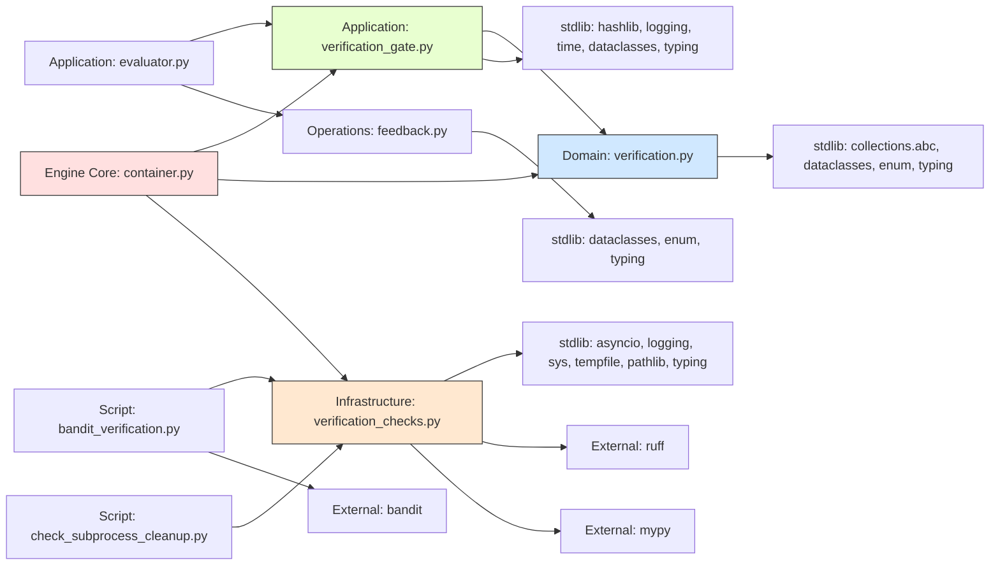

# ARCHITECTURE MINDMAP — WBS-1 Verification Subsystem

## 1. SYSTEM IDENTITY

- **Primary Language:** Python 3.12 (inferred from `from __future__ import annotations` and `str | None` syntax)
- **Frameworks:** None. Pure asyncio stdlib. pytest for testing (inferred from `tests/unit/` files and `@pytest.mark.asyncio` usage).
- **Architectural Style:** Hexagonal (Ports & Adapters). The verification subsystem is a self-contained hexagonal wedge: domain types in the innermost ring, application orchestration in the middle, infrastructure adapters on the outside, composed by a container in `engine_core/`.
- **Entry Points:**
  - `VerificationGate.run(artifact)` — `orchestrator/application/verification_gate.py:128`
  - `EvaluatorService.evaluate(task, output)` — `orchestrator/application/evaluator.py:81` (calls gate at line 106)
  - `ServiceContainer.build(budget, ...)` — `orchestrator/engine_core/container.py:455` (composition root, wires gate at line 647)
- **Build/Config Files:**
  - `pyproject.toml` — ruff rules, bandit config, python deps
  - `.github/workflows/ci.yml` — CI pipeline including black, ruff, lint-imports, mypy, pytest, bandit steps
  - `scripts/check_subprocess_cleanup.py` — CI guard for subprocess kill pattern
  - `scripts/bandit_verification.py` — targeted bandit scan for verification module

---

## 2. MODULE INVENTORY

### Domain Types `orchestrator/domain/`
- **Responsibility:** Pure data types with zero I/O, zero infrastructure imports. Defines the vocabulary for verification outcomes, receipts, and policy.
- **Type:** Core logic (domain layer, innermost ring)
- **Exports:** `CheckOutcome`, `ExecutionReceipt`, `VerificationPolicy`
- **Internal Structure:**
  - `orchestrator/domain/verification.py` (120 lines) — 3 dataclass/type definitions with properties
- **Dependencies:**
  - → stdlib: `collections.abc.Mapping`, `dataclasses`, `enum`, `typing`
  - → [Internal: none — domain is dependency-free]

### Gate Orchestration `orchestrator/application/`
- **Responsibility:** Chain-of-responsibility runner that composes checks, executes them against an artifact, and produces a structured verdict. Provides the hard deterministic floor beneath LLM scoring.
- **Type:** Application logic (middle ring)
- **Exports:** `VerificationCheck` (dataclass, line 36), `GateResult` (dataclass, line 46), `VerificationGate` (class, line 105), `compute_artifact_hash` (function, line 97), `CheckFn` (type alias, line 31)
- **Internal Structure:**
  - `orchestrator/application/verification_gate.py` (238 lines) — gate loop, receipt generation, policy enforcement
- **Dependencies:**
  - → `orchestrator.domain.verification` — `CheckOutcome`, `ExecutionReceipt`, `VerificationPolicy` (line 24)
  - → stdlib: `hashlib`, `logging`, `time`, `dataclasses`, `typing`

### Evaluator Integration `orchestrator/application/`
- **Responsibility:** Invokes the gate before LLM scoring; passes deterministic results through `CritiqueReport.deterministic`
- **Type:** Application logic (integration seam)
- **Exports:** `EvaluatorService` (class)
- **Internal Structure:**
  - `orchestrator/application/evaluator.py` — `_evaluate_inner()` at line 100 calls `self._gate.run(output)` at line 106, populates `CritiqueReport(deterministic={...})` at lines 121-131 and 229-240
- **Dependencies:**
  - → `orchestrator.domain.verification` (via verification_gate)
  - → `orchestrator.operations.feedback` — `CritiqueReport`, `CritiqueItem`, `CritiqueSeverity`

### Feedback/Critique Data Model `orchestrator/operations/`
- **Responsibility:** Structured evaluation output carrying score + critique items + deterministic verification data
- **Type:** Data layer
- **Exports:** `CritiqueReport` (dataclass), `CritiqueItem` (dataclass), `CritiqueSeverity` (enum)
- **Internal Structure:**
  - `orchestrator/operations/feedback.py` — `CritiqueReport.deterministic` field at line 81, `to_dict()` serialization at line 158, `from_dict()` at line 180
- **Dependencies:**
  - → stdlib: `dataclasses`, `enum`, `typing`

### Check Adapters `orchestrator/infrastructure/`
- **Responsibility:** Concrete verification check implementations that execute shell commands, compile Python, or scan text patterns. Each adapter wraps a single check concern as an async callable.
- **Type:** Infrastructure (outer ring — shell execution, file I/O)
- **Exports:** `VerificationCheckAdapter` (class, line 189), `default_checks()` (factory function, line 209), 5 factory functions (`_make_syntax_check`, `_make_lint_check`, `_make_type_check`, `_make_build_check`, `_make_security_check`)
- **Internal Structure:**
  - `_run_command` (async fn, line 30) — subprocess lifecycle, timeout handling with `proc.kill()`/`proc.wait()`, 4-tier return code system (0=ok, -1=timeout, -2=not-found, -3=unexpected)
  - `_make_syntax_check` (line 75) — `compile()` call, catches `SyntaxError`
  - `_make_lint_check` (line 88) — ruff via stdin pipe
  - `_make_type_check` (line 107) — mypy via tempfile, cleanup in `finally`
  - `_make_build_check` (line 133) — `exec()` in isolated empty namespace
  - `_make_security_check` (line 152) — substring pattern match, skips comments
  - `default_checks()` (line 209) — returns [syntax, build, security] always, conditionally appends lint + type
- **Dependencies:**
  - → stdlib: `asyncio`, `logging`, `sys`, `tempfile`, `pathlib.Path`, `typing`
  - → [External: ruff, mypy] — optional tool dependencies, graceful degradation

### Composition Root `orchestrator/engine_core/`
- **Responsibility:** Wires all services at system startup. `ServiceContainer.build()` creates the gate with default checks and policy, injects it into `EvaluatorService`.
- **Type:** Interface / composition root (infrastructure)
- **Exports:** `ServiceContainer` (dataclass, line 192), `build()` (factory method, line 455)
- **Internal Structure:**
  - `orchestrator/engine_core/container.py` — lines 619-672: gate creation, policy definition, gate injection into evaluator

### CI Guard Scripts `scripts/`
- **Responsibility:** Static analysis guards that prevent regression of subprocess cleanup patterns and security baseline.
- **Type:** Cross-cutting concern (CI tooling)
- **Exports:**
  - `scripts/check_subprocess_cleanup.py` — AST parser that verifies every `asyncio.create_subprocess_exec` has paired `proc.kill()` + `proc.wait()` in timeout handlers
  - `scripts/bandit_verification.py` — runs bandit on verification modules with medium+ severity, exits non-zero on unannotated violations

### Test Suite `tests/`
- **Responsibility:** Regression-proof the WBS-1 verification changes with 91 tests across 4 test files
- **Type:** Testing
- **Internal Structure:**
  - `tests/unit/test_domain_verification.py` — 26 tests (CheckOutcome, ExecutionReceipt, VerificationPolicy, GateResult)
  - `tests/unit/test_verification_gate.py` — 11 tests (legacy backward compat)
  - `tests/unit/test_verification_checks.py` — 10 tests (syntax/build/security adapters)
  - `tests/regression/test_wbs1_verification_regression.py` — 44 tests (comprehensive regression: backward compat, edge cases, performance, concurrency, policy, CritiqueReport)

---

## 3. DEPENDENCY GRAPH

---

## 4. DATA FLOW — TOP 3 CRITICAL PATHS

### Path 1: Task Evaluation with Verification Gate

- **Sequence:** `EvaluateStage` (engine_core) → `EvaluatorService.evaluate()` (evaluator.py:81) → `VerificationGate.run(artifact)` (verification_gate.py:128) → per-check `_check(artifact)` (verification_checks.py) → `GateResult` (receipts + hash + score) → `CritiqueReport(deterministic=...)` (feedback.py) → returned to pipeline
- **State Changes:**
  - evaluator.py:106 — `gate_result` assigned from gate.run()
  - evaluator.py:109-119 — if gate fails: return early with `FAIL_SCORE_FLOOR` (0.15) and `passed_validators=False`
  - evaluator.py:122-232 — if gate passes: proceed to LLM self-consistency scoring, append `deterministic_data` to final `CritiqueReport`
  - verification_gate.py:149 — `artifact_hash` computed (SHA-256)
  - verification_gate.py:158-201 — each check populates `passed_map` dict, `reasons` dict, `receipts` list
  - verification_gate.py:219 — aggregate score computed (1.0 if all pass, else 0.15)
- **Failure Modes:**
  - Any check exception → caught as `BLOCKED` (verification_gate.py:183), not propagated. Gate continues to next check.
  - Subprocess timeout → `_run_command` returns -1 (verification_checks.py:63), logged, check fails with TIMEOUT reason
  - Policy-required check missing → `NOT_RUN` receipt (verification_gate.py:211-216), aggregate score set to 0.15
- **Observability Gap:** The `proc.wait()` call after `proc.kill()` on timeout (verification_checks.py:62) is itself an async operation that could hang. No timeout is applied to the kill+wait cleanup sequence.

### Path 2: Container Wiring at Startup

- **Sequence:** `Orchestrator.__init__` → `ServiceContainer.build()` (container.py:455) → `default_checks()` (verification_checks.py:209) → 5 adapter factories → `VerificationGate(checks=gate_checks, policy=verification_policy)` (container.py:647) → injected into `EvaluatorService(client, budget, verification_gate=gate)` (container.py:659-664)
- **State Changes:**
  - container.py:629-632 — `gate_checks` list built from wrapped adapter functions
  - container.py:634-643 — `verification_policy` created with syntax+security=REQUIRED, build+lint+type=RECOMMENDED
  - container.py:647 — `VerificationGate` instantiated with policy reference
  - container.py:664 — gate injected into evaluator as `verification_gate=verification_gate`
- **Failure Modes:**
  - Import error on any verification module → caught by `except ImportError` (container.py:658), `verification_gate` set to `None`, gate disabled silently
  - If gate is `None`, evaluator skips verification entirely (evaluator.py:104: `if self._gate is not None`)
- **Observability Gap:** When import fails and gate is disabled, the only indicator is a debug-level log (container.py:659). No metric, telemetry event, or warning to operator.

### Path 3: Validation Query — Determination of Gate Result

- **Sequence:** External caller (pipeline, UI, dashboard) → `GateResult.passed` (verification_gate.py:66) or `GateResult.score` (line 60) or `GateResult.failure_summary` (line 71) or `GateResult.status_summary` (line 80) → read-only properties computed on demand from `checks` dict and `receipts` list
- **State Changes:** None (stateless queries on a snapshot result)
- **Failure Modes:**
  - Divergence between `checks` dict and `receipts` list: if a code path adds to `passed_map` but forgets `receipts`, the two views disagree. Per static audit, all paths populate both consistently.
  - Empty gate (`checks=[]`): `passed` returns `True` (line 68: `if self.checks else True`), meaning a gate with no checks silently "passes" everything. This is the design intent (opt-in checks), but a misconfigured gate provides no protection.
- **Observability Gap:** No tracking of how often `passed` returns `True` due to an empty gate vs. actual passing checks.

---

## 5. DESIGN PATTERNS & DECISIONS

| Pattern | Evidence (file:line or structural indicator) | Confidence | Rationale |
|---------|----------------------------------------------|------------|-----------|
| **Chain of Responsibility** | `VerificationGate.run()` iterates `self._checks` sequentially, runs all, collects aggregate result (verification_gate.py:159-201) | CONFIRMED | Named in docstring at line 106. Each `VerificationCheck` is a handler; the gate is the chain. |
| **Strategy** | `CheckFn` protocol (`Callable[[str], Awaitable[tuple[bool, str]]]`) at verification_gate.py:31. Multiple concrete strategies via `_make_*_check()` factories. | CONFIRMED | The protocol defines strategy interface; each factory creates a different strategy. |
| **Adapter** | `VerificationCheckAdapter` wraps infrastructure-level `_check` functions into `CheckFn`-compatible callables (verification_checks.py:189-203). | CONFIRMED | Infrastructure adapters know subprocess/I/O; gate knows only `CheckFn` protocol. |
| **Mediator** | `VerificationGate` orchestrates all checks but contains zero business logic about what each check does (verification_gate.py:105-238). | CONFIRMED | Gate delegates entirely to `check.run()`. Does not interpret failures beyond "passed = all(results)". |
| **Frozen DTO** | `ExecutionReceipt` and `VerificationPolicy` are `@dataclass(frozen=True)` (domain/verification.py:47, 76). | CONFIRMED | Domain types immutable by design. |
| **Feature Flag (planned)** | Referenced in docstring at verification_gate.py:233 as planned but NOT implemented. | SPECULATIVE | Docstring says "opt-in checks via ORCH_VERIFY_ACTS" but no flag check exists. |

---

## 6. ENTITY MAP

| Entity | Key Fields | Defined In | Consumed By | Persistence |
|--------|------------|------------|-------------|-------------|
| `CheckOutcome` | value (str enum): NOT_RUN, PASSED, FAILED, BLOCKED, OPTIONAL, RECOMMENDED, REQUIRED, MANDATORY | `domain/verification.py:17-44` | `verification_gate.py`, `verification_checks.py` | in-memory (enum) |
| `ExecutionReceipt` | check_name: str, outcome: CheckOutcome, reason: str?, duration_ms: float?, command: str?, artifact_hash: str? | `domain/verification.py:47-73` | `verification_gate.py` (producer), consumers of `GateResult.receipts` | in-memory (via GateResult) |
| `VerificationPolicy` | checks: Mapping[str, CheckOutcome], task_types: Frozenset?, artifact_types: Frozenset? | `domain/verification.py:75-120` | `VerificationGate.run()` (line 205), `container.py` (definition) | in-memory (frozen dataclass) |
| `VerificationCheck` | name: str, run: CheckFn, command: str? | `verification_gate.py:35-42` | `VerificationGate.run()` (line 163) | in-memory (dataclass) |
| `GateResult` | checks: dict[str, bool], reasons: dict[str, str], score: float, receipts: list[ExecutionReceipt], artifact_hash: str?, policy: VerificationPolicy? | `verification_gate.py:45-91` | `EvaluatorService._evaluate_inner()` (evaluator.py:106-119, 228-240) | in-memory (transient — produced per evaluation) |
| `CritiqueReport` | task_id: str, score: float, items: list[CritiqueItem], passed_validators: bool, deterministic: dict? | `operations/feedback.py:59-84` | Pipeline stages, state persistence via `to_dict()` | SQLite via ProjectState serialization |

---

## 7. RISK REGISTER

| Risk | Severity | Location (file:line if possible) | Evidence |
|------|----------|----------------------------------|----------|
| Subprocess cleanup timeout on kill+wait could block | HIGH | `verification_checks.py:58-62` | `proc.wait()` after `proc.kill()` has no timeout. If process ignores SIGKILL (Windows edge), `wait()` could block indefinitely. V7 defect hunt D1 fix added kill+wait without timeout. |
| Empty gate passes everything silently | MEDIUM | `verification_gate.py:68` and `verification_gate.py:219-220` | `passed` returns `True` when `checks` is empty (line 68). Score is 1.0 when `passed_map` empty (line 220). Misconfigured gate reports success with no protection. |
| Gate disabled on import failure with minimal visibility | MEDIUM | `container.py:658-659` | `except ImportError` silently swallows failure, sets `verification_gate = None`. Only debug log reports this. No alarm, metric, or escalation. |
| CritiqueReport.deterministic dict unversioned | MEDIUM | `feedback.py:81` | `deterministic` is untyped `Optional[dict]` — no schema version, no structural validation. Serialization/deserialization is blind passthrough. Schema drift could cause silent data corruption. |
| Frozen VerificationPolicy has mutable dict runtime | LOW | `domain/verification.py:89` | `checks: Mapping[str, CheckOutcome] = field(default_factory=dict)` — type annotation says immutable but `dict` at runtime is mutable. Frozen prevents attribute reassignment but not dict content mutation. |
| Broad except swallows CancelledError | LOW | `verification_gate.py:183` | `except Exception as exc` catches `CancelledError` (3.9+). Intentional (fail-closed), but converts cancellation into BLOCKED receipt, confusing operators. |

---

## 8. UNCERTAINTY LOG

| Question | Location | Possible Interpretations | Impact if Wrong |
|----------|----------|--------------------------|-----------------|
| Is `ORCH_VERIFY_ACTS` flag implemented or planned? | `verification_gate.py:233` docstring | A) Planned feature documented but not coded. B) Implemented in file not in scope (engine.py or crosscutting config). | If B, gate already has a feature-flag disabling path this analysis missed. |
| Relationship between `FAIL_SCORE_FLOOR` (0.15, 0-1 scale) and `CritiqueReport.score` (5.0 default, 0-10 scale) | `evaluator.py:119` vs `feedback.py:77` | A) Floor (0.15) same scale as LLM scores (0.0-1.0). B) Scale mismatch callers must account for. | Floor could be misinterpreted as "15% quality" if on a different scale. |
| Are ruff/mypy guaranteed in PATH at runtime? | `verification_checks.py:92-94`, `verification_checks.py:118-121` | A) Optional — graceful degradation. B) Assumed present in production. | If B but absent, gate silently runs only 3 of 5 checks, reducing coverage. |
| Can `proc` be unbound when except fires? | `verification_checks.py:56-63` | A) `create_subprocess_exec` always assigns `proc` before any await (line 42). B) Some runtime path could fail between line 42 and completion. | If B, `proc.kill()` raises `NameError`, caught by outer `except Exception` (line 67), returning -3 — losing timeout-specific signal. |
