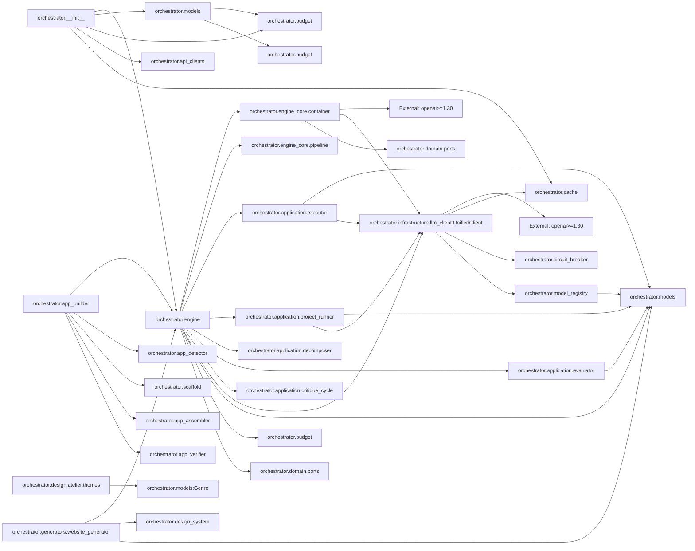

# ARCHITECTURE MINDMAP

## 1. SYSTEM IDENTITY

- **Primary Language:** Python 3.10+ (`pyproject.toml:5`: `requires-python = ">=3.10"`)
- **Frameworks:**
  - `openai>=1.30,<2.0` — OpenRouter API client (`pyproject.toml:28`)
  - `google-genai>=1.0,<2.0` — Gemini provider (`pyproject.toml:29`)
  - `pydantic>=2.0,<3.0` — Data validation (`pyproject.toml:31`)
  - `aiosqlite>=0.19,<1.0` — State persistence (`pyproject.toml:30`)
  - `httpx>=0.24.0` — HTTP transport (`pyproject.toml:36`)
  - `aiohttp>=3.9.0` — Async HTTP (`pyproject.toml:37`)
  - `tenacity>=8.2.0` — Retry logic (`pyproject.toml:38`)
  - `playwright>=1.40.0` — Browser automation (`pyproject.toml:35`)
  - `newspaper3k>=0.2.8` — Web scraping (`pyproject.toml:36`)
  - `instructor>=1.0,<2.0` — Structured output via LLM (`pyproject.toml:41`)
  - `tabulate>=0.8.0` — Terminal tables (`pyproject.toml:43`)
- **Architectural Style:** **Layered modular monolith** with hexagonal core. Justification: All code lives in a single Python package (`orchestrator/`), but is organized into strict layer boundaries enforced by `import-linter` with 4 contracts (`domain-purity`, `application-no-concrete-infra`, `application-services-no-engine`, `engine-core-no-loose-infra` at `.importlinter:1-110`). The `domain/ports.py` defines abstract protocols (hexagonal "ports") that `infrastructure/` adapters satisfy via structural subtyping.
- **Entry Points:**
  - `orchestrator/__main__.py:22` — `python -m orchestrator` → delegates to `cli.main()`
  - `orchestrator/cli.py:1819` — `main()` → argparse dispatch to subcommands: `build`, `analyze`, `agent`, `slash`, `dashboard`, `chat`, `kanban`, `website`, `cache-stats`, `nexusscope`
  - `orchestrator/application/chat_cli.py:112` — `run_chat()` — interactive spec-gathering REPL
  - `orchestrator/cli.py:2435` — `cmd_chat()` — async launch of chat session
  - `orchestrator/cli.py:330` — `cmd_build()` — AppBuilder pipeline for code projects
  - `orchestrator/cli.py:1710` — `_cmd_website()` — website generation
- **Build/Config Files:**
  - `pyproject.toml` — Build (hatchling), deps, mypy strict 48-module list, ruff config (line-length 100, google docstrings), coverage ratchet (6%), pytest markers
  - `.importlinter` — 4 layer-boundary contracts
  - `.github/workflows/ci.yml` — CI pipeline
  - `orchestrator_config.json` — Runtime config
  - `.env` — API keys (OPENROUTER_API_KEY)

## 2. MODULE INVENTORY

### 1. Orchestrator Core `orchestrator/`
- **Responsibility:** Top-level package — re-exports all public API symbols for external consumers
- **Type:** Core logic / facade
- **Exports:** `Orchestrator`, `Budget`, `DiskCache`, `StateManager`, `UnifiedClient`, `Model`, `Task`, `TaskResult`, `TaskStatus`, `TaskType`, `ProjectState`, `ProjectStatus`, `CodebaseAnalyzer`, `DryRunRenderer`, `ExecutionPlan`, `TaskPlan`, `ProgressEntry`, `ProgressWriter` (`orchestrator/__init__.py:13-27`)
- **Internal Structure:**
  - `__init__.py` — Package facade re-exports
  - `__main__.py` — `python -m orchestrator` entry point (`__main__.py:22`: `cli.main()`)
  - `cli.py` — Root CLI dispatcher (2450 lines): argparse, 12 subcommands
  - `engine.py` — `Orchestrator` class: core control loop, task execution, budget enforcement (2193 lines)
  - `models.py` — All data models, enums, routing/cost tables, budget logic (918 lines)
  - `design_system.py` — DesignSystem, ColorTokens, TypographyTokens, Layout, BrandTone (240 lines)
- **Dependencies:**
  - → `orchestrator/engine_core/` — delegates `_execute_task()` to `TaskPipeline`
  - → `orchestrator/domain/ports.py` — consumes `CachePort`, `StatePort`, `EventPort` protocols
  - → `orchestrator/infrastructure/` — resolves adapters via ServiceContainer
  - → External: `openai>=1.30` — OpenRouter SDK for all LLM calls

### 2. Engine Core `orchestrator/engine_core/`
- **Responsibility:** Task execution pipeline with pluggable stages, project planning, state coordination, and dependency injection container
- **Type:** Core logic
- **Exports:** `ServiceContainer`, `TaskPipeline`, `PipelineContext`, `PipelineRunner`, `ProjectPlanner`, `StateCoordinator`, `ContextService`, pipeline stages (`GenerateStage`, `CritiqueStage`, `EvaluateStage`, etc.)
- **Internal Structure:**
  - `container.py` — `ServiceContainer.build()`: wires 30+ collaborators (638 lines)
  - `pipeline.py` — `TaskPipeline`: composable stage runner with `PipelineContext` (166 lines)
  - `pipeline_runner.py` — `PipelineRunner`: orchestrates execution across tasks
  - `project_planner.py` — `ProjectPlanner`: decomposes spec into task DAG
  - `state_coordinator.py` — `StateCoordinator`: manages task state transitions
  - `context_service.py` — `ContextService`: manages token context per task
  - `stages/` — Directory of `PipelineStage` implementations (GenerateStage, CritiqueStage, EvaluateStage, ValidateStage, PreflightStage, PersuasionDefenseStage, SelfConsistencyStage)
- **Dependencies:**
  - → `orchestrator/domain/ports.py` — consumes `CachePort`, `StatePort`, `EventPort`, `ValidatorPort`, `PlannerPort`
  - → `orchestrator/infrastructure/` — resolves concrete adapters
  - → `orchestrator/models.py` — consumes `Task`, `TaskResult`, `TaskStatus`, `Model`
  - → `orchestrator/application/` — delegates to `skill_optimizer`, `evaluator`

### 3. Domain Boundaries `orchestrator/domain/`
- **Responsibility:** Abstract interfaces (hexagonal ports), domain exceptions, model registry, service contracts
- **Type:** Core logic / interface definition
- **Exports:** `CachePort`, `StatePort`, `EventPort`, `ConfigPort`, `LLMClient`, `PlannerPort`, `TelemetryPort`, `PolicyEnginePort`, `HookRegistryPort`, `ValidatorPort`, `TaskQueuePort`, `SkillStorePort`, `LSPValidatorPort`, `SnapshotPort`, `QualityScorer`, `Reranker`, 14 Null adapters, `ModelRegistry`, domain exceptions
- **Internal Structure:**
  - `ports.py` — 16 `Protocol` classes (ports + quality/reranking) with 14 Null adapter implementations (606 lines)
  - `model_registry.py` — `ModelRegistry`: 52-model registry with cost tables, UNAVAILABLE_MODELS
  - `exceptions.py` — Domain exception hierarchy
  - `services/` — Service-level interfaces (e.g. `PlannerService`, `ValidatorService`)
- **Dependencies:**
  - → `orchestrator/models.py` — consumes `ProjectState`, `Model`, `TaskType`
  - → **No infrastructure imports** — enforced by `.importlinter` contract 1: "domain-purity" (no infra dependency)

### 4. Application Services `orchestrator/application/`
- **Responsibility:** Orchestration-agnostic business logic — skill optimization, project execution, decomposition, evaluation, chat
- **Type:** Core logic
- **Exports:** `SkillOptimizer`, `SkillManager`, `SkillStore`, `ProjectRunner`, `ChatCLI`, `ConversationAgent`, `TaskExecutor`, `Evaluator`, `Decomposer`, `CritiqueCycle`, `BudgetEnforcer`, `FallbackHandler`, `ResumptionService`, `GitBridge`, `DashboardBridge`, `ModelHealthTracker`, `ContextCompressor`, `CandidateSelector`
- **Internal Structure:**
  - `chat_cli.py` — Interactive REPL for spec gathering (194 lines)
  - `conversation_agent.py` — NL dialogue → structured spec
  - `project_runner.py` — `ProjectRunner`: coordinates `run_project`, `dry_run`
  - `vs_selector.py` — `CandidateSelector`: VS candidate selection with quality scoring + prefilter
  - `skill_optimizer.py` — `SkillOptimizer`: per-TaskType prompt evolution via trajectory feedback
  - `skill_store.py` — `SkillStore`: aiosqlite trajectory + skill persistence
  - `evaluator.py` — Task result evaluator
  - `executor.py` — Task executor
  - `decomposer.py` — Project spec → task DAG decomposition
  - `critique_cycle.py` — Cross-model review loop
  - `skills/` — Per-TaskType skill documents (`code_generation.md`, `code_review.md`, etc.)
- **Dependencies:**
  - → `orchestrator/domain/ports.py` — consumes `CachePort`, `StatePort`
  - → `orchestrator/models.py` — consumes `Task`, `TaskType`, `ProjectState`
  - → `orchestrator/infrastructure/` — resolves concrete adapters
  - → **Not to `orchestrator/engine.py`** — enforced by `.importlinter` contract 3: "application-services-no-engine"

### 5. Infrastructure `orchestrator/infrastructure/`
- **Responsibility:** Concrete adapter implementations for all domain ports — LLM client, state persistence, caching, telemetry, streaming
- **Type:** Infrastructure
- **Exports:** `UnifiedClient` (LLM), `StateManager` (SQLite), `DiskCache` (SQLite), `TelemetryCollector`, `ImageGenClient`, `PathProvider`, `SemanticCache`, `SnapshotStore`
- **Internal Structure:**
  - `llm_client.py` — `UnifiedClient`: async OpenRouter-only API client with caching, retry, circuit breaker (727 lines)
  - `state.py` — `StateManager`: aiosqlite-backed project state persistence
  - `cache.py` — `DiskCache`: SQLite-backed LLM response cache
  - `image_client.py` — `ImageGenClient`: OpenRouter image generation
  - `telemetry.py` — `TelemetryCollector`: per-model metrics
  - `streaming.py` — Streaming response handler
  - `cache_optimizer.py` — Cache optimization utilities
  - `caching.py` — Caching middleware
  - `secure_cache.py` — Secure cache wrapper
  - `semantic_cache.py` — Semantic embedding-based cache
  - `path_provider.py` — Platform-aware path resolution
  - `snapshot_store.py` — State snapshot persistence
- **Dependencies:**
  - → `orchestrator/domain/ports.py` — implements `CachePort`, `StatePort`
  - → `orchestrator/models.py` — consumes `Model`, `TaskType`, `ProjectState`
  - → External: `aiosqlite>=0.19` — state/cache DB
  - → External: `openai>=1.30` — OpenRouter API SDK

### 6. Website Generator `orchestrator/generators/`
- **Responsibility:** Design-system-driven website generation with LLM-powered content and section assembly
- **Type:** Core logic / feature module
- **Exports:** `WebsiteGenerator`, `ContentResearcher`, `ClientInfo`, `WebsiteConfig`, `WebsiteBuildResult`, `WebsiteQualityValidator`
- **Internal Structure:**
  - `website_generator.py` — `WebsiteGenerator.generate()`: 6-step pipeline (1898 lines)
  - `image_generator.py` — SVG placeholder image fallback
  - `website_validator.py` — Quality validation (Lighthouse, WCAG, SEO)
- **Dependencies:**
  - → `orchestrator/engine.py` — uses `Orchestrator._execute_task()` for section generation
  - → `orchestrator/design_system.py` — consumes `DesignSystem`
  - → `orchestrator/models.py` — consumes `Task`, `TaskType`
  - → `orchestrator/budget.py` — consumes `Budget`

### 7. Design System `orchestrator/design/`
- **Responsibility:** Curated design themes, archetypes, macrostructures, taste skills, and anti-slop guards
- **Type:** Utility / cross-cutting concern
- **Exports:** `AtelierTheme` (20 themes), `Theme` (catalog), `Archetype` (13 nav, 8 footer), `Macrostructure` (17 layouts), taste-skill injector, anti-slop validator
- **Internal Structure:**
  - `atelier/themes.py` — 20 AtelierTheme definitions (OKLCH colors, fonts, genres)
  - `catalogs/themes.py` — Theme catalog with genre classification
  - `catalogs/archetypes.py` — Navigation (N1-N13) and footer (Ft1-Ft8) patterns
  - `catalogs/macrostructures.py` — 17 page layout templates
  - `catalogs/routing.py` — Genre→macrostructure routing table
  - `skills/` — Taste skill documents (`image_to_code.SKILL.md`, `imagegen_web.SKILL.md`)
- **Dependencies:**
  - → `orchestrator/models.py` — consumes `Genre`, `DesignVariant`
  - → **No infrastructure dependencies** — pure data layer

### 8. Agents `orchestrator/agents/`
- **Responsibility:** Specialized agent implementations for the autonomous development pipeline
- **Type:** Core logic
- **Exports:** `BaseAgent`, `CoordinatorAgent`, `DeveloperAgent`, `ReviewerAgent`, `TesterAgent`, `DevOpsAgent`, `ResearcherAgent`, `ProductManagerAgent`, `QCAgent`, `UserAgent`
- **Internal Structure:**
  - `base.py` — `BaseAgent` abstract class
  - `coordinator.py` — Agent orchestration coordinator
  - `developer.py` — Code generation specialist
  - `reviewer.py` — Code review specialist
  - `product_manager.py` — Product planning specialist
  - `researcher.py` — Research/analysis specialist
  - `devops.py` — Deployment/CI specialist
  - `qc.py` — Quality control specialist
  - `user.py` — User persona simulation
  - `persona.py` — Agent persona definitions
  - `persona_modes.py` — Agent persona configuration modes
  - `metrics.py` — Agent performance metrics
  - `rate_limiter.py` — Per-agent rate limiting
- **Dependencies:**
  - → `orchestrator/engine.py` — uses Orchestrator for task dispatch
  - → `orchestrator/models.py` — consumes `Task`, `TaskType`, `Model`

### 9. Application Builders `orchestrator/appbuilder/` (and root `app_builder.py`)
- **Responsibility:** Full-stack application generation pipeline — detect, scaffold, assemble, verify
- **Type:** Core logic / feature module
- **Exports:** `AppBuilder`, `AppProfile`, `AppBuildResult`, `AssemblyReport`, `VerifyReport`
- **Internal Structure:**
  - `app_builder.py` — `AppBuilder.build()`: 7-step pipeline (detect → scaffold → orchestrate → assemble → deps → verify → docs)
  - `app_detector.py` — `AppDetector.detect()`: description → `AppProfile` (language, framework, app type)
  - `scaffold.py` — `ScaffoldEngine.scaffold()`: project skeleton generation
  - `app_assembler.py` — `AppAssembler.assemble()`: file assembly
  - `app_verifier.py` — `AppVerifier.verify_local()`/`verify_docker()`: test execution
  - `architecture_advisor.py` — `ArchitectureAdvisor`: framework recommendations
- **Dependencies:**
  - → `orchestrator/engine.py` — uses `Orchestrator.run_project()`
  - → `orchestrator/domain/ports.py` — consumes `CachePort`, `StatePort`

## 3. DEPENDENCY GRAPH

**Notable import constraints** (enforced by `.importlinter:1-110`):
- `domain/` → **NO** → `infrastructure/` — contract 1: "domain-purity"
- `application/` → **NO** → concrete `infrastructure/` adapters — contract 2: "application-no-concrete-infra" (only uses domain ports)
- `application/` → **NO** → `engine.py` — contract 3: "application-services-no-engine"
- `engine-core/` → **NO** → directly to loose `infrastructure/` — contract 4: "engine-core-no-loose-infra"

## 4. DATA FLOW — TOP 3 CRITICAL PATHS

### Path 1: Website Generation
- **Sequence:** `User CLI input` → `orchestrator/cli.py:1713:_cmd_website()` → `orchestrator/generators/website_generator.py:276:WebsiteGenerator.generate()` → `generators/website_generator.py:306:_create_section_tasks()` → `generators/website_generator.py:462:_build_section_prompt()` → `orchestrator/engine.py:_execute_task()` → `infrastructure/llm_client.py:280:UnifiedClient.call()` → `External: OpenRouter API` → `website_generator.py:316:component .tsx files written` → `website_generator.py:690:_assemble_nextjs_page()` → `Output: outputs/<project>/`
- **State Changes:** `config.sections` iterated → per-section `Task` objects created → LLM response cached in `DiskCache` (SQLite) → each section component written to `output_dir/components/{section}.tsx` → `page.tsx` assembled with imports → `package.json` written with deps
- **Failure Modes:**
  - LLM auth failure → `orchestrator/api.py` raises `AuthenticationError` → `website_generator.py:372` catches and uses content-brief fallback assembly
  - Image gen permission error (`Errno 13` on `public/` directory) → `website_generator.py:371` catches and logs, falls through to assembled project without images
  - Circuit breaker open after 5 consecutive failures → `infrastructure/llm_client.py:131` sets `openrouter` breaker to OPEN → all subsequent calls fail instantly for 60s
- **Observability Gap:** `orchestrator/generators/website_generator.py:371` — the `Permission denied` error during image generation is logged but not surfaced in the CLI result message. The `_cmd_website()` function (cli.py:1795) checks `result.success` or file existence but has no branch for partial failure.

### Path 2: Code Project Build
- **Sequence:** `CLI: python -m orchestrator --project "..."` → `orchestrator/cli.py:964:_async_new_project()` → `ProjectEnhancer.analyze()` for spec improvement → `AppBuilder.build()` → `AppDetector.detect()` infers language/framework → `Orchestrator.run_project_streaming()` → `ProjectPlanner.decompose()` → `TaskPipeline` per task → `UnifiedClient.call()` → LLM response → `ValidateStage` → `CritiqueStage` → `EvaluateStage` → `output_writer.write_output_dir()` → `organize_project_output()` generates tests
- **State Changes:** Project state persisted via `StateManager.save_project()` (SQLite) at each milestone → task results stored in `ProjectState.results` → budget deducted per task → checkpoints saved per task
- **Failure Modes:**
  - Budget exceeded mid-task → `BudgetExceededError` at `engine.py:445` → task marked `FAILED`
  - Decomposition JSON parse failure → retried once with different model (`engine.py:45` docstring)
  - Validation failure → `PreflightStage` returns WARN/BLOCK → pipeline may retry or abort
- **Observability Gap:** `orchestrator/cli.py:1107` — `ProgressRenderer` consumes streaming events but the raw event stream has no guaranteed delivery — if the renderer crashes, events are lost.

### Path 3: Interactive Chat Loop
- **Sequence:** `python -m orchestrator chat` → `orchestrator/cli.py:2435:cmd_chat()` → `application/chat_cli.py:112:run_chat()` → `ConversationAgent.start()` → interactive `input()` loop → `ConversationAgent` refines spec → user says "go" → `_launch_build()` → `Orchestrator.run_project()` → same as Path 2
- **State Changes:** `ConversationAgent.ready` flag set to `True` when spec is complete → `accepted_enhancements` list accumulated → spec → task DAG → project state persisted
- **Failure Modes:**
  - OpenAI client init failure → `chat_cli.py:125` catches, `sys.exit(1)` — hard abort
  - User EOF/Ctrl+C → `chat_cli.py:144` catches, returns cleanly
- **Observability Gap:** `application/chat_cli.py:139-152` — all user input and agent output is printed to stdout with no logging to file. No conversation persistence.

## 5. DESIGN PATTERNS & DECISIONS

| Pattern | Evidence (file:line or structural indicator) | Confidence | Rationale |
|---------|----------------------------------------------|------------|-----------|
| **Hexagonal Architecture (Ports & Adapters)** | `orchestrator/domain/ports.py:1-80` defines 6 `Protocol` classes; `infrastructure/llm_client.py` implements `CachePort` implicitly; `infrastructure/state.py` implements `StatePort` | CONFIRMED | Domain protocols are runtime-checkable (`@runtime_checkable`) with NullAdapter variants for testing. Concrete adapters satisfy protocols implicitly via structural subtyping — no ABC registration. |
| **Strangler Fig (Incremental Extraction)** | `orchestrator/engine_core/pipeline.py:1`: "Strangler Fig extraction of engine.py _execute_task"; `orchestrator/application/executor.py` splits from engine | CONFIRMED | Pipeline stages are being extracted from the monolithic `engine.py` (2193 lines) into `engine_core/` and `application/` modules. The docstring on `pipeline.py` explicitly names this pattern. |
| **Mediator Pattern** | `orchestrator/engine.py:1` docstring: "Orchestrator Engine — Core Control Loop"; `engine_core/container.py.ServiceContainer` wires 30+ collaborators | CONFIRMED | `Orchestrator` class mediates between all subsystems (task factory, pipeline, state, budget, cache, circuit breaker). CLI dispatch `main()` also acts as a Mediator for subcommands. |
| **Pipeline (Chain of Responsibility)** | `orchestrator/engine_core/pipeline.py:30:PipelineContext` + `stages/GenerateStage`, `CritiqueStage`, `EvaluateStage`, `ValidateStage`, `PreflightStage` | CONFIRMED | `TaskPipeline` runs ordered stages, each reading/writing `PipelineContext`. Stages are pluggable and independently testable. |
| **Circuit Breaker** | `orchestrator/circuit_breaker.py` + `infrastructure/llm_client.py:131` instantiates `CircuitBreaker(name="openrouter", failure_threshold=5, reset_timeout=60.0)` | CONFIRMED | Model-level failure tracking with automatic probe after timeout. Circuit breaker state persisted via `StatePort.save_circuit_breaker_state()`. |
| **Events / Event Bus** | `orchestrator/domain/ports.py` defines `EventPort` protocol; `orchestrator/unified_events.py` contains `ProjectCompletedEvent`; `orchestrator/events/` directory | CONFIRMED | Unified event bus replaces 4 previous event systems. Events typed by class with `EventPort.publish()` protocol. |
| **Strategy Pattern (Provider Routing)** | `orchestrator/models.py` defines `ROUTING_TABLE` and `TASK_PROVIDER_STRATEGIES`; `orchestrator/model_selector.py:ModelSelector` selects models per task | LIKELY | Task types route to provider/model combinations. `ProviderStrategy` dataclass controls sort order, throughput, and latency preferences. |
| **Retry with Backoff (Tenacity)** | `pyproject.toml:38`: `tenacity>=8.2.0`; `infrastructure/llm_client.py:280` `UnifiedClient.call()` uses `run_with_resilience()` | CONFIRMED | Manifests as both tenacity retry decorators and manual retry loops. ResiliencePolicy supports fallback model chains. |
| **Null Object Pattern** | `domain/ports.py`: `NullCache`, `NullState`, `NullEventBus`, `NullHookRegistry` | CONFIRMED | All six domain ports have NullAdapter implementations for testing. Explicitly documented in line 18: "NullAdapters for testing". |
| **Service Container / DI** | `orchestrator/engine_core/container.py:1` `ServiceContainer` class: factory wiring 30+ collaborators | CONFIRMED | Phase 5 of MAEP: extracted from `Orchestrator.__init__`. `Orchestrator` now accepts pre-built container. |
| **Taste-Skill (Anti-slop injection)** | `orchestrator/design/skills/image_to_code.SKILL.md` frontmatter: "Elite website image-to-code skill for Codex"; `orchestrator/design/slop_test.py` validates against 20+ anti-patterns | CONFIRMED | Generated frontend code gets prepended with design rules preventing common AI defaults (Inter-only fonts, purple-cyan gradients, centered heroes). Gated at GenerateStage. |
| **Per-TaskType Skill Optimization** | `orchestrator/application/skill_optimizer.py`: evolves prompt via trajectory feedback; `application/skills/` directory has 7 .md files per TaskType | CONFIRMED | Each TaskType has a skill document that the optimizer evolves using trajectory data from previous executions. Edits are constrained to 150 tokens. |

## 6. ENTITY MAP

| Entity | Key Fields | Defined In | Consumed By | Persistence |
|--------|------------|------------|-------------|-------------|
| `Task` | `id: str`, `type: TaskType`, `prompt: str`, `dependencies: list[str]`, `target_path: str`, `acceptance_threshold: float`, `max_iterations: int`, `model: Model \| None`, `design_variant: DesignVariant \| None` | `orchestrator/models.py` (dataclass) | `engine.py`, `engine_core/pipeline.py`, `application/task_executor.py`, `application/decomposer.py` | in-memory within ProjectState; SQLite via StateManager |
| `TaskResult` | `task_id: str`, `output: str`, `score: float`, `model: str`, `cost_usd: float`, `tokens_used: dict`, `attempts: list`, `status: TaskStatus`, `critiques: list[str]` | `orchestrator/models.py` (dataclass) | `engine.py`, `application/evaluator.py`, `output_writer.py` | SQLite via StateManager |
| `ProjectState` | `project_id: str`, `tasks: list[Task]`, `results: list[TaskResult]`, `status: ProjectStatus`, `execution_order: list[str]`, `budget_used: float`, `created_at: float`, `metadata: dict` | `orchestrator/models.py` (dataclass) | `engine.py`, `application/project_runner.py`, `cli.py`, `state.py` | SQLite table via `StateManager` |
| `ProjectStatus` | Enum: `PENDING`, `RUNNING`, `COMPLETED`, `FAILED`, `CANCELLED`, `PAUSED` | `orchestrator/models.py` | `engine.py`, `state.py`, `cli.py` | in-memory |
| `Budget` | `max_usd: float`, `max_time_seconds: float`, `spent_usd: float`, `soft_cap_multiplier: float`, `phase_caps: dict` | `orchestrator/budget.py` | `engine.py`, `cli.py`, `application/project_runner.py` | in-memory |
| `Model` | Enum with 52+ OpenRouter model IDs (e.g. `GPT_5 = "openai/gpt-5"`) | `orchestrator/models.py` | `infrastructure/llm_client.py`, `model_selector.py`, `model_registry.py` | in-memory (enum) |
| `TaskType` | Enum: `CODE_GEN`, `CODE_REVIEW`, `REASONING`, `WRITING`, `DATA_EXTRACT`, `SUMMARIZE`, `EVALUATE`, `IMAGE_GEN` | `orchestrator/models.py` | Every module — routing, prompts, skill selection | in-memory (enum) |
| `DesignSystem` | `tone: str`, `colors: ColorTokens`, `typography: TypographyTokens`, `spacing: Spacing`, `layout: Layout`, `brand_name: str`, `industry: str` | `orchestrator/design_system.py` (dataclass) | `generators/website_generator.py`, `design/` modules | in-memory |
| `WebsiteConfig` | `page_type: str`, `sections: list[str]`, `framework: str`, `atelier_theme: str`, `description: str`, `brand_name: str`, `dependencies: list[str]` | `orchestrator/generators/website_generator.py` (dataclass) | `WebsiteGenerator.generate()`, `_create_section_tasks()`, `_assemble_nextjs_page()` | in-memory |
| `AtelierTheme` | `slug: str`, `genre: str`, `paper_oklch: str`, `ink_oklch: str`, `heading_font: str`, `body_font: str`, `motion_direction: str`, `accent_hue: str` | `orchestrator/design/atelier/themes.py` (dataclass) | `_build_section_prompt()`, `theme_to_prompt_context()` | in-memory (20 in `ATELIER_THEMES` dict) |

## 7. RISK REGISTER

| Risk | Severity | Location (file:line) | Evidence |
|------|----------|---------------------|----------|
| **engine.py is 2193-line God class — 50% extraction target** | CRITICAL | `orchestrator/engine.py:1-2193` | Docstring declares "Strangler Fig extraction" but the file is still 2193 lines. The `README.md:101` lists it as "Mediator facade (2,643 lines, −50% from original)" confirming it was 5,286+ lines and is only halfway extracted. |
| **Website generator crash on image gen permission error is silent** | MEDIUM | `orchestrator/generators/website_generator.py:371` | `errno. Permission denied` during `_generate_images()` is logged at ERROR but `_cmd_website()` in `cli.py:1795` only checks `result.success` or file-exists — it never prints the image error to the user. |
| **Orphaned CLI path — cli_website.py has --sections but main cli.py didn't** | MEDIUM | `orchestrator/cli_website.py:60-87` | `cli_website.py` supports `--sections`, `--industry`, `--company-name`, `--page-type` flags but was never wired into the main `cli.py:1819` dispatch. (Fixed in this session — now in `cli.py:1701`.) |
| **ContentResearcher was a pure stub for non-website paths** | MEDIUM | `orchestrator/generators/website_generator.py:156-228` | `generate_content_brief()` returned hardcoded SaaS strings. The "TODO: Integrate with Nexus Search" comment at line 161 confirms this was never implemented. (Fixed in this session with LLM-powered version.) |
| **28+ legacy modules in mypy ignore_errors** | MEDIUM | `pyproject.toml:157-211` | The mypy override list at lines 157-211 has 26+ entries with `ignore_errors = true`. The REASONIX.md explicitly says "do NOT add new code there" and "modules should be removed from it as they are typed" — no remediation plan visible. |
| **40+ ruff rule codes ignored** | MEDIUM | `pyproject.toml:118-155` | Ruff config at lines 118-155 ignores `F401`, `F811`, `F821`, `E402`, `I001` and 40+ other rule codes. The REASONIX.md says "new code should NOT rely on these ignores" but there's no enforcement mechanism. |
| **Browser testing dependency may be dead code** | LOW | `pyproject.toml:35` | `playwright>=1.40.0` is listed as a dependency but `orchestrator/browser_testing.py` is at the root level with no import from any core path. May be unused or conditionally imported. |
| **Semantic cache may fail to import at runtime** | LOW | `orchestrator/engine.py:64` | `from .semantic_cache import SemanticCache` — the semantic cache exists in `infrastructure/` but the import in engine.py is a flat module import. If the flat file doesn't exist, this is a runtime ImportError. |

## 8. UNCERTAINTY LOG

| Question | Location | Possible Interpretations | Impact if Wrong |
|----------|----------|--------------------------|-----------------|
| Is `orchestrator/semantic_cache.py` a flat file or a re-export? | `orchestrator/engine.py:64` import | (A) A flat module at `orchestrator/semantic_cache.py` — (B) A re-export from `orchestrator/infrastructure/semantic_cache.py` — (C) A missing file causing ImportError at runtime | If (C), `Orchestrator.__init__` will crash. The `infrastructure/semantic_cache.py` exists but engine.py imports from the flat path. |
| How many total flat modules exist in `orchestrator/`? | `orchestrator/` directory tree | The directory_tree shows ~300+ entries but was truncated. The REASONIX.md says "300+ flat modules" | Inventory counts of "core modules" are approximate. Some root-level files may be deprecated/orphaned. |
| Is `orchestrator/browser_testing.py` actually used? | `orchestrator/browser_testing.py` | (A) Used by a non-CLI path (IDE Backend) — (B) Dead code | If (B), it adds unnecessary dependency weight (playwright) and dead code surface. |
| What is the `router/` directory structure? | `orchestrator/engine_core/router/` | Appeared in directory tree but wasn't explored deeply. Likely contains routing/fallback logic for model selection. | Missing from module inventory. |
| Truncation note — analysis depth | 4 packages deprioritized: `orchestrator/engine_core/stages/`, `orchestrator/design/catalogs/`, `orchestrator/events/`, `orchestrator/plugins/` | These subpackages contain stage implementations, catalog themes, event definitions, and plugin architecture. | Stage implementations may contain pipeline logic not captured in the core PipelineContext analysis. Events may include additional event types beyond `ProjectCompletedEvent`. |
